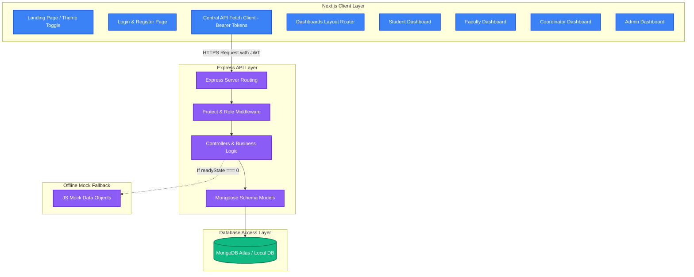
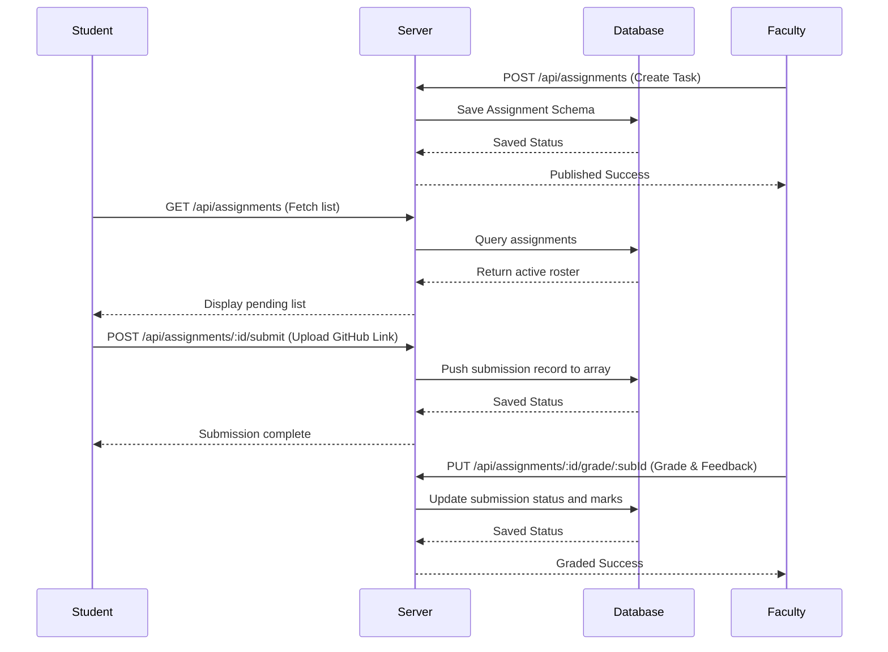

# System Architecture & Workflow Diagram

This document details the software architecture layers and interaction workflows of the **Smart Campus Management Platform**.

---

## 🏗️ Architecture Design

The platform is designed as a decoupled **Client-Server Architecture** utilizing Next.js (frontend) and Node/Express (backend) communicating over secure JSON REST APIs.

---

## 🔄 Core Workflows

### 1. User Authentication
1. User enters credentials (Email/Password or mock Google login).
2. Backend validates password hash (bcrypt) or role matching.
3. Server signs a JWT token and stores it in cookies/headers.
4. Frontend stores the token in `localStorage` and appends it to subsequent request headers.
5. Router checks current user role and redirects to the appropriate dashboard portal.

### 2. Assignment Workflow

### 3. QR Code Attendance Check-In
1. **Faculty Session Creation**: Faculty specifies course code and date. Backend saves attendance roster session.
2. **Student Code Check-in**: Student types the session course code in their dashboard check-in widget.
3. **Validation**: Server searches for active attendance sheets matching the code. If found, student's status is toggled to `present`.
