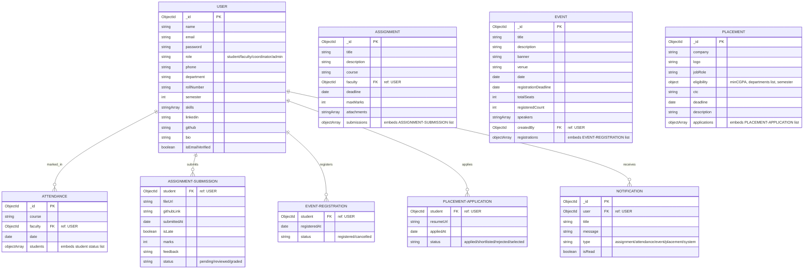

# Database Entity Relationship (ER) Diagram

This document contains the Entity Relationship schema defining the collections utilized in the **Smart Campus** MongoDB database.

---

## 📊 Entity Relationship Model

---

## 🗃️ Collection Descriptions

1. **Users**: Stores profile credentials, personal details, roles, and links for all members.
2. **Attendance**: Roster sheets referencing class attendance sessions marked by faculty.
3. **Assignments**: Homework specifications created by faculty, nesting the submissions array of students.
4. **Events**: Seminars and workshops posted by coordinators, nesting registrations.
5. **Placements**: Recruitment drives posted by admin, nesting applications.
6. **Notifications**: System alerts sent dynamically to students upon assignment releases, attendance marks, placement open notices, and registration confirmations.
